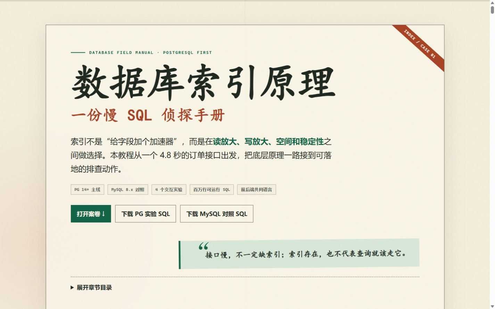

# 数据库索引原理：慢 SQL 侦探手册

一份面向前后端开发者的中文长页面技术分享材料，以订单列表慢接口为主线，讲清数据库索引原理、执行计划和接口性能优化方法。



## 直接阅读

双击打开 `index.html` 即可。页面完全离线运行，无需安装依赖或启动构建工具；支持桌面端、移动端、键盘操作和打印为 PDF。

页面包含：

- PostgreSQL 14+ 为主、MySQL 8.x / InnoDB 对照
- 页、B-tree/B+Tree 心智模型、选择性、回表与 MVCC
- 联合、覆盖、部分、表达式、GIN、GiST、SP-GiST、BRIN、Hash 索引
- 4 个核心交互实验和 1 个索引类型问诊工具
- 深分页、可选筛选、任意排序、N+1 等前后端协作问题
- 慢接口排查流程、迷思小测和可打印速查表
- PostgreSQL 与 MySQL 可运行实验脚本

## PostgreSQL 实验

`labs/postgresql.sql` 是纯 SQL，不依赖 `psql` 元命令。用 pgAdmin、DBeaver、DataGrip、`psql` 或其他支持多语句的 PostgreSQL 控制台打开文件，连接到本地或一次性数据库后，选择“执行脚本 / Run All”即可。账号需要当前数据库的 `CREATE` 权限；如果已存在同名实验 schema，还需要是其所有者。

脚本顶部提供 3 个可编辑配置；快速体验时只需把订单数改小：

```sql
SET db_index_lab.order_count = '250000';
SET db_index_lab.tenant_count = '100';
SET db_index_lab.target_tenant = '42';
```

脚本会删除并重建专用 schema `db_index_lab`。默认保留实验对象，文件末尾提供了可选的 `VACUUM` 和清理语句。

## MySQL 对照实验

`labs/mysql.sql` 同样是纯 SQL，最低版本为 MySQL 8.0.18。可在 MySQL Workbench、DBeaver、DataGrip 或其他支持多语句的 MySQL 控制台中打开，选择“执行脚本 / Run All”。账号需要建库及表、索引 DDL 权限。需要缩小数据量时修改文件顶部配置：

```sql
SET @order_count = 250000;
SET @tenant_count = 100;
```

`EXPLAIN ANALYZE` 需要 MySQL 8.0.18 或更新版本。脚本会创建专用 database `db_index_lab` 并重建其中的实验表，因此需要建库权限，不面向 MariaDB。

两份脚本围绕同一套订单字段展开：`id`、`tenant_id`、`user_id`、`status`、`total_cents`、`created_at`、`updated_at`、`deleted_at`、`metadata`。状态值统一为大写的 `NEW/PAID/SHIPPED/CANCELLED/REFUNDED`，便于在教程与实验之间直接对照。

## 文件结构

```text
.
├── index.html
├── ACCEPTANCE.md
├── README.md
├── assets
│   └── preview.png
└── labs
    ├── postgresql.sql
    └── mysql.sql
```

所有示例耗时、成本和页访问图均用于教学，不构成固定性能承诺。真实结论应来自目标版本、代表性数据和实际执行计划。

## 验收记录

完整的桌面、移动端、键盘、交互、打印与内容准确性验收证据记录在 `ACCEPTANCE.md`。页面运行时验收使用 Codex 内置浏览器；打印版另生成 PDF 并逐页渲染检查。
